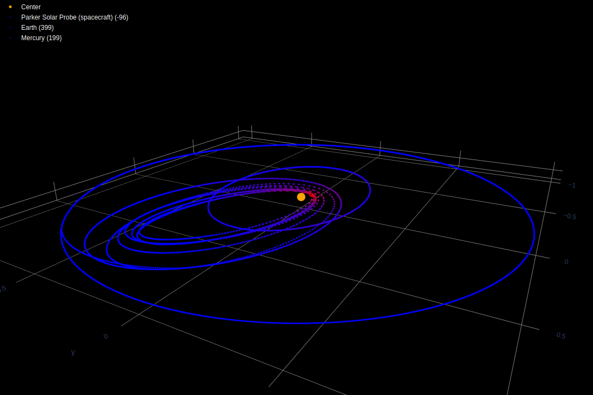
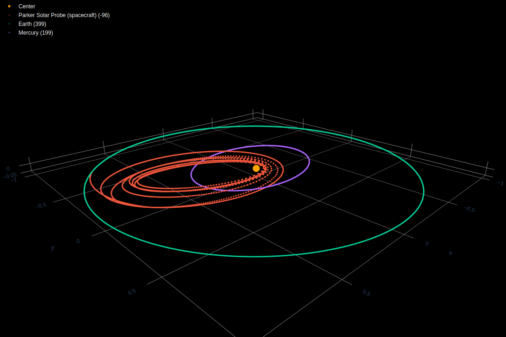

# AstroPlot.py
AstroPlot plots the result of JPL's [HORIZONS System](https://ssd.jpl.nasa.gov/?horizons)

## Example Output




## Collecting ephemeris:
* Ensure that Vectors mode is selected

* Table output should be in CSV format with Corrections at None

* Tables should end with the $$EOE declaration
## Running:
```bash
chmod 755 ./AstroPlot.py
./AstroPlot.py /path/to/csv(s)
```

## Planned features
* ~~On-the-fly unit conversion~~
* Close encounters
* Automatic querying of the HORIZONS system (No planned date, as the system will soon undergo changes with the API, rendering any current code unapplicable)
* Animation (When plotly supports *effecient* 3D animations)
* Automatic re-centering
